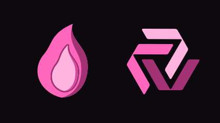

# Brazier

A companion iPhone app for self-hosted Grafana: real push for firing and resolved alerts, sign-in the way self-hosters run Grafana, dashboards on a phone.


## Quickstart

```
python3 scripts/check.py
```

There is no app yet. The repository holds the study, the architecture, the decisions and the mark; milestone 1 is the push relay (`relay/`), milestone 2 the app on TestFlight (`app/`). See [the build plan](docs/brief/project-brief.md) and [how the pieces fit](docs/concepts/architecture.md).

<p></p>

## What is here

| Path | What |
|---|---|
| `docs/brief/` | The project brief: done looks like, who for, constraints, out of scope |
| `docs/concepts/` | Architecture: the app, the relay, Keystone, Grafana, as boards with parts and connections tables |
| `docs/decisions/` | Decision records: thin native client, self-hosted relay first, Keystone JWT sign-in (advanced), sign-in through your Grafana's own login and the relay asking it who you are |
| `docs/reference/compatibility.md` | Any Grafana, any sign-in: the deployment matrix and what each row needs |
| `docs/reference/` | The relay's routes, settings and payload mapping |
| `docs/diagrams/` | Board specs (`*.board.json`) and their rendered SVGs |
| `docs/sessions/` | Session records |
| `assets/brand/` | The mark (the Curl), icons and the pair with the Guys Inc symbol, from Branding-Standards |
| `design/mark-rounds/` | Every mark considered before the Curl, with its generator |
| `relay/` | The push relay: one Cloudflare Worker, one KV namespace; Grafana's webhook in, Apple's push out ([README](relay/README.md)) |
| `grant/` | The push grant: lends a self-hosted relay a short-lived APNs token so our key never leaves us (decision 0005) |
| `demo/` | The reviewer's demo Grafana: the stack on the OVH box and the Worker in front of it at demo.brazier.gicloud.org |
| `contract/` | Every call the app and the relay make, run against real Grafana 11, 12 and 13 in Docker and in CI |
| `app/` | The iPhone and iPad app: SwiftUI, xcodegen; `make` targets build, archive and upload from the Mac mini |
| `scripts/check.py` | CI: front matter on every docs page, valid JSON boards |
| `scripts/listing.mjs`, `scripts/screenshots.mjs`, `scripts/release.mjs` | The App Store listing filed from `docs/reference/listing.md`, the screenshots, the build attached to the version |
| `scripts/site.py` | The docs site, built from this folder and published at <https://guys-inc-public.github.io/Brazier/> ([privacy](docs/privacy.md), [support](docs/support.md)) |

## Grafana

Brazier works with Grafana and is not affiliated with Grafana Labs. Grafana is a trademark of Grafana Labs; Brazier's name and mark are its own.
