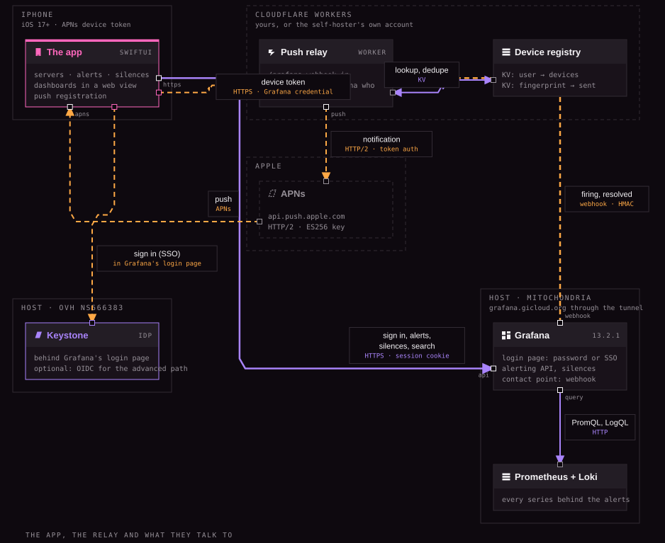
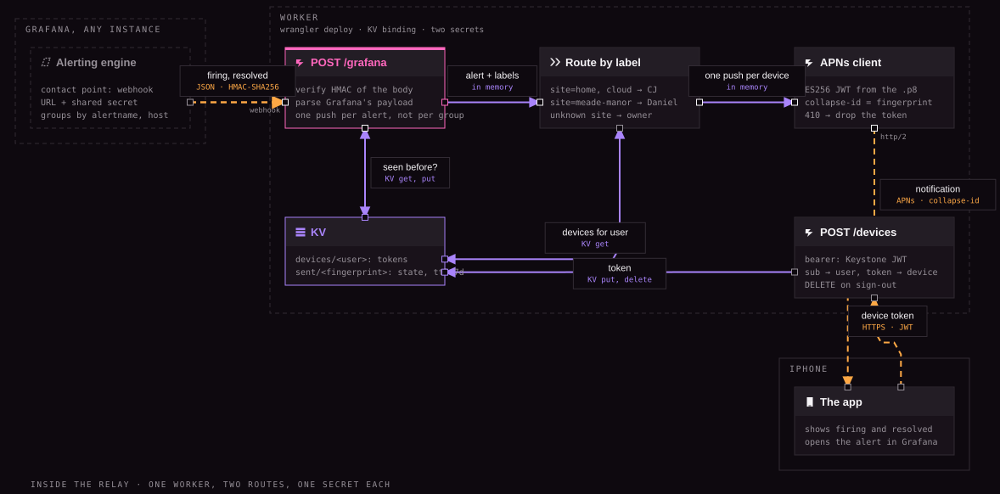

# How the pieces fit

## In one paragraph
The app on the phone signs in through Keystone with PKCE and calls Grafana's API with that JWT. Grafana's alerting posts firing and resolved alerts to the relay, a Cloudflare Worker, which looks up the site's owner's devices in KV and pushes through APNs. The app registers its device with the relay using the same Keystone JWT. Decisions: [0001](../decisions/0001-a-thin-native-client-over-grafanas-api.md), [0002](../decisions/0002-the-push-relay-is-self-hosted-first.md), [0003](../decisions/0003-sign-in-is-keystone-through-grafanas-jwt-auth.md).

## The system

| Part | Where | Job |
|---|---|---|
| The app | iPhone, SwiftUI, iOS 17+ | Servers, alerts, silences, dashboards in a web view, push registration |
| Push relay | Cloudflare Worker, KV | Receives Grafana's webhook, routes by site label, pushes through APNs, keeps the device registry |
| Keystone | OVH, keystone.gicloud.org | Public OIDC client for the app; the JWT Grafana trusts; the JWKS Grafana fetches |
| Grafana | mitochondria, 13.2.1 | Alerting API, silences, search, dashboards; a webhook contact point; JWT auth |
| APNs | Apple | Delivers the push; needs a key from the developer account |

| From → to | What travels | How |
|---|---|---|
| App → Keystone | sign in | OIDC authorization code with PKCE, public client, app URL scheme |
| App → Grafana | alerts, silences, search, health | HTTPS through the tunnel, `X-JWT-Assertion` |
| Grafana → relay | firing, resolved | Webhook contact point, HMAC-SHA256 over the body |
| App → relay | device token | HTTPS, bearer Keystone JWT |
| Relay → APNs | notification | HTTP/2, provider token auth, collapse-id = alert fingerprint |
| Relay → KV | devices, dedupe | KV get and put, sent fingerprints expire after 7 days |

## The relay

One Worker, two routes, one KV namespace, two secrets. Routes, settings and payload mapping: [Relay reference](../reference/relay.md). The boards are `docs/diagrams/*.board.json`, rendered with Branding-Standards' `scripts/render_board.js`.
